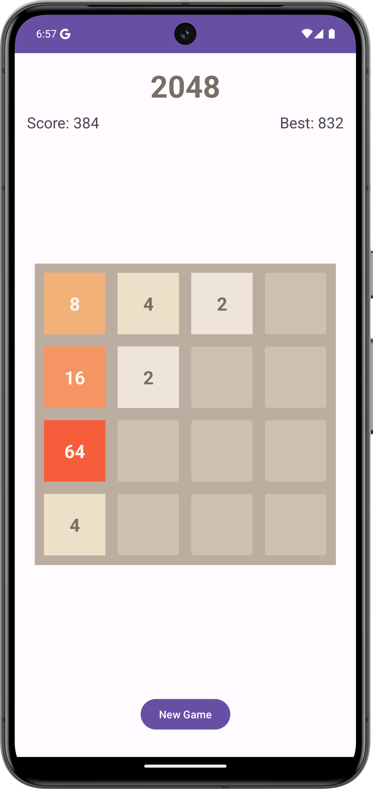

# 2048 Game for Android

A modern implementation of the classic 2048 puzzle game for Android devices, built with Kotlin.

## Features

- Smooth swipe controls
- Score tracking with high score persistence
- Clean, modern UI
- Multiple merges in a single move
- Game state persistence
- Responsive grid layout

## How to Play

1. Swipe in any direction (up, down, left, right) to move all tiles
2. When two tiles with the same number touch, they merge into one tile with the sum of their values
3. Multiple merges can happen in a single move (e.g., [2][2][4] becomes [8])
4. After each move, a new tile with a value of 2 or 4 appears
5. The game is won when a tile with the value 2048 is created
6. The game is over when no more moves are possible

## Technical Details

- Built with Kotlin
- Follows MVVM architecture pattern
- Uses Android Jetpack components
- Minimum SDK: 24
- Target SDK: 34

## Building the Project

1. Clone the repository
2. Open the project in Android Studio
3. Build and run the project on your device or emulator

## License

This project is open source and available under the MIT License.
